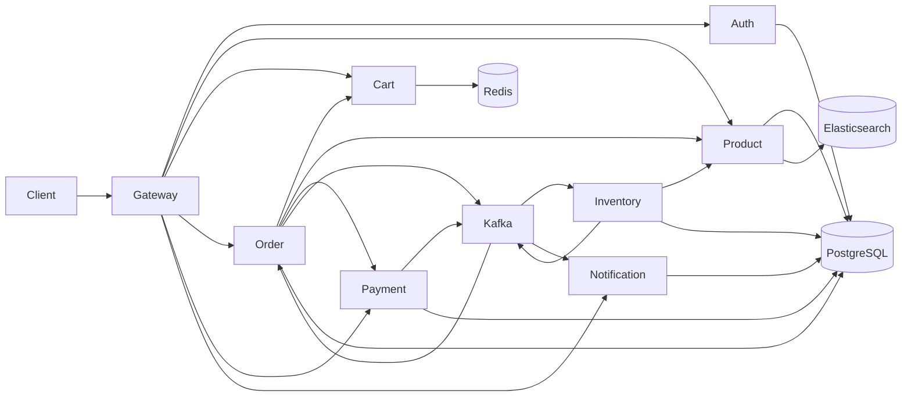

# Cloth Backend System Design

## Services
- Gateway Service: single public entrypoint, JWT validation, route forwarding, and internal-route blocking.
- Auth Service: signup/login, PostgreSQL user store, JWT issuance, bootstrap admin creation.
- Product Service: catalog, categories, variants, image metadata, Elasticsearch search, and internal stock adjustment endpoint.
- Cart Service: Redis-backed carts with product lookups and stock-aware quantity checks.
- Order Service: checkout orchestration, order persistence, payment initiation, inventory workflow coordination, and order lifecycle events.
- Payment Service: payment records, simulated payment success/failure, refund handling, and payment status events.
- Inventory Service: inventory reservation workflow, reservation persistence, stock validation, and stock deduction through product-service internals.
- Notification Service: consumes order/payment lifecycle events and stores customer notifications.
- Kafka: asynchronous backbone for payment, inventory, and notification workflows.
- PostgreSQL: separate databases for auth, product, order, payment, inventory, and notification domains.
- Redis: fast cart storage.
- Elasticsearch: product search index.

## Request Flow
1. Client calls gateway.
2. Gateway validates JWT for protected routes, injects `X-User-Id` and `X-User-Role`, and blocks `/internal/**` paths.
3. Customer adds variants to cart through cart-service.
4. Checkout hits order-service, which reads cart contents, fetches variant details, creates an order in `PENDING_PAYMENT`, and creates a payment in payment-service.
5. Customer completes payment through payment-service.
6. Payment-service publishes `cloth.payment.status` with `COMPLETED` or `FAILED`.
7. Order-service consumes the payment event. On success it publishes `cloth.inventory.reservation.requested`.
8. Inventory-service validates stock against product-service, persists the reservation result, adjusts stock, and publishes `cloth.inventory.reservation.completed`.
9. Order-service consumes the reservation result. On success it marks the order `CONFIRMED` and clears the cart. On failure it marks the order `REJECTED` and requests a refund.
10. Order-service publishes `cloth.order.lifecycle` for business milestones, and notification-service stores customer-facing notifications.

## Kafka Topics
- `cloth.payment.status`: produced by payment-service for payment completion, failure, and refunds.
- `cloth.inventory.reservation.requested`: produced by order-service after successful payment.
- `cloth.inventory.reservation.completed`: produced by inventory-service after stock handling.
- `cloth.order.lifecycle`: produced by order-service for customer-visible order updates.

## Data Ownership
- `authdb`: users and credentials.
- `productdb`: catalog, categories, variants, product images.
- `orderdb`: customer orders and order items.
- `paymentdb`: payment state and refund history.
- `inventorydb`: inventory reservation ledger.
- `notificationdb`: customer notifications.
- Redis: cart hashes keyed by `cart:{userId}`.
- Elasticsearch: denormalized product documents.

## Mermaid

